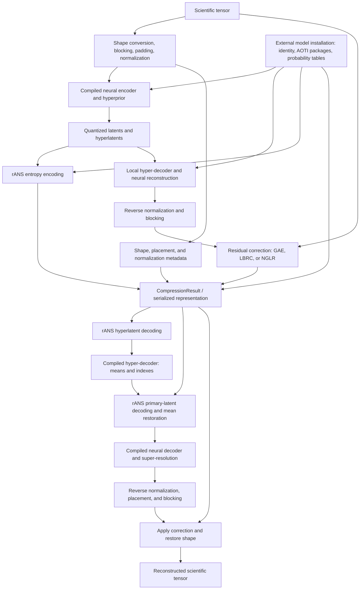

# CAESAR software inventory for the SoftwareX manuscript

Prepared 28 September 2026 from repository commit `14e1e72ebaa9238c0ec0a1da7a6c3b70ec73ac4f`. This is an implementation inventory, not manuscript prose. Paths below are relative to the repository root; named classes and functions provide source evidence. API details are deliberately brief.

**Scope:** The author confirms that ADIOS2 integration code is maintained elsewhere. This inventory describes the integration-facing facilities visible here, but does not assess that external implementation. Absence from this checkout must not be represented as absence of an ADIOS2 integration.

**Evidence levels:** “Implemented” means inspected source contains the functionality. “Test available” means a relevant test exists, not that it passed on every platform. “Previously reported” refers to repository documentation, not an independently repeated experiment. “Author-reported” identifies platform results supplied by the author. “Verified in this review” is restricted to the checks listed at the end. The requested task is a source inventory, not a new validation campaign; no further test execution is part of this work.

## 2.1 Software architecture

### Major components

| Component | Responsibility and evidence |
| --- | --- |
| Native compression/decompression orchestration | `Compressor::compress()` and `Decompressor::decompress()` coordinate preprocessing, compiled neural execution, entropy coding, correction, and reconstruction. Sources: `CAESAR/models/caesar_compress.{h,cpp}`, `caesar_decompress.{h,cpp}`. |
| Tensor preparation | `to_5d()` / `restore_from_5d()` adapt supported input ranks. `ScientificDataset`, `blockHW()`, `data_filtering()`, and `apply_inst_norm_batched()` implement spatial blocking, temporal preparation, constant-block filtering, and normalization. Sources: `CAESAR/data_utils.{h,cpp}`, `CAESAR/dataset/dataset.{h,cpp}`. |
| Neural model | Python defines and exports the encoder/hyperprior and reconstruction networks. `CompressorMix` contains a residual compression model; the decoder also invokes `BluePrintConvNeXt_SR` for super-resolution. Sources: `CAESAR_compressor.py`, `CAESAR_hyper_decompressor.py`, `CAESAR_decompressor.py`, `pyCAESAR/models/BCRN/bcrn_model.py`. |
| Native model execution | `ModelCache` loads three AOTInductor packages through LibTorch's `AOTIModelPackageLoader`. Native code passes and receives tensors using `run()`. Sources: `CAESAR/models/model_cache.h`, compression/decompression implementations. |
| Entropy coding | CPU `RansEncoder` / `RansDecoder` encode quantized latent and hyperlatent symbols using indexed probability tables. NVIDIA implementation: `caesar::rans_cuda::Codec`, with kernels in `rans_cuda_kernels.cu`. Sources: `CAESAR/models/range_coder/`. |
| Residual correction | Default GAE uses `PCACompressor`; alternatives are `caesar::lbrc::compress/decompress` and `nglr::compress/decompress`. Sources: `runGaeCuda.{h,cpp}`, `lbrc.{h,cpp}`, `nglr.{h,cpp}`, `nglr_train.cpp`, `nglr_network.{h,cpp}`, `correction_method.h`. |
| Lossless correction compression | CPU Zstandard and optional NVIDIA nvCOMP operations compress correction representations. Sources: `runGaeCuda.cpp`, `lbrc.cpp`, `nglr.cpp`, `gpu_lossess.{h,cpp}`. |
| Identity and installation management | Python catalog/installation management is paired with native manifest validation, artifact discovery, and caching. Sources: `model_registry.py`, `compile_model.py`, `model_metadata.h`, `model_utils.cpp`, `model_cache.h`. |
| File interface | CLI code writes latent streams, hyperlatent streams, and reconstruction metadata. Sources: `CAESAR/CAESAR.cpp`, `CAESAR/cli_result_header.h`. This is separate from the external ADIOS2 buffer format. |

### Compression data flow

1. **Prepare the scientific tensor.** Validate rank, floating-point input, frame count, and requested target; select variable zero for 5D inputs; convert internally to float32 and a 5D layout. Construct `ScientificDataset`, spatially block into 256-by-256 regions, prepare eight-frame windows, and record padding and block placement. Exactly constant windows are represented by a stored value instead of neural latents. Normalize nonconstant samples using their mean and range. Evidence: `Compressor::compress()`, `ScientificDataset::ScientificDataset()`, `blockHW()`, `data_filtering()`, `apply_inst_norm_batched()`.
2. **Run the neural encoder in batches.** The compiled compressor returns quantized primary latents, probability-table indexes, quantized hyperlatents, and hyperlatent indexes. The fixed native inference batch size is 128 samples, with a partial final batch. Evidence: `Compressor::compress()`, `CAESAR_compressor.py::CompressorMix::forward()`.
3. **Generate a local reconstruction.** The compiled hyper-decoder supplies latent means; the reconstruction network decodes mean-adjusted latents. Native code reverses normalization and block placement. This reconstruction is needed during compression to calculate the correction. Evidence: calls to `hyper_decompressor_model_->run()` and `decompressor_model_->run()` in `Compressor::compress()`.
4. **Entropy-code the two latent streams.** Use CUDA rANS when its build/runtime conditions are satisfied; otherwise transfer symbols/indexes to the CPU and use threaded native rANS. Evidence: `rans_cuda::enabled()`, `Codec::encode()`, `RansEncoder::encode_with_indexes()`.
5. **Compute residual correction.** Compare original data with the local reconstruction and produce GAE, LBRC, or NGLR metadata and correction bytes. Evidence: correction-method branches in `Compressor::compress()`.
6. **Return or serialize the result.** `CompressionResult` combines latent streams, model identity, shape/normalization information, and correction data. The CLI serializes this into three files; an external integration needs its own reviewed packing contract. Evidence: `CompressionResult`, `save_encoded_streams()`, `save_complete_metadata()`.

**Diagram implication:** GAE does not correct entropy-coded bytes. It uses the original tensor and a local neural reconstruction and produces a separate correction stream. The architecture should show that branch.

### Decompression data flow

1. Read the compressed representation and check its model identity and shape metadata.
2. Decode hyperlatents using rANS and the installed hyperprior tables.
3. Run the compiled hyper-decoder to regenerate means and primary-latent probability indexes.
4. Decode primary latents using those indexes and the installed Gaussian tables; add the predicted means.
5. Run the neural decoder/super-resolution network; reverse normalization and block placement, restore filtered constant windows, and undo spatial blocking.
6. Apply the selected correction, remove remaining padding, and restore the selected input's rank.

Evidence: `Decompressor::decompress()` and `decompress_internal()` in `CAESAR/models/caesar_decompress.cpp`. CPU entropy decoding uses a thread pool; CUDA decoding uses `Codec::decode()`.

### Proposed implementation-based diagram



The installation-to-result arrow means **record model identity**, not embed model packages. The decoder also consumes the matching external packages/tables; omit repeated arrows for readability. Add ADIOS2 as an application/storage wrapper around this core only after reviewing the separate integration; its internals are not inferred here.

### CPU/GPU responsibilities and modularity

Neural inference and much tensor preprocessing/correction execute through LibTorch on the installed model's device. The explicit custom CUDA implementation is the rANS kernel file; a class named `PCACompressor` in `runGaeCuda.cpp` uses LibTorch tensor operations and is not exclusively a CUDA kernel implementation. GAE computes a covariance eigendecomposition with `torch::linalg_eigh`. Optional nvCOMP accelerates lossless correction compression on NVIDIA hardware; host Zstandard paths also exist. Final strings, vectors, metadata, and CLI file writes are host-side. Therefore, “entirely GPU-resident compression” is too strong. Evidence: `runGaeCuda.cpp::PCA::fit`, `PCACompressor::compressLossless/decompressLossless`, `gpu_lossess.cpp`, `rans_cuda.cpp`.

NGLR differs from the foundation model: it trains a fresh correction predictor in native LibTorch during compression. The top-level caller supplies the selected device for training, while the default correction codec device remains CPU. Predictor weights are stored in the result. Evidence: `nglr.h`, `nglr_train.cpp::compress()`, the NGLR branch in `caesar_compress.cpp`.

The implementation separates models, entropy coding, and correction into modules, and correction algorithms are selectable. However, arbitrary replacement is not a general plugin capability: the runtime assumes particular latent shapes, three package names, fixed probability-table dimensions, and architecture `caesar-bcrn-v1`. Compatible registered checkpoints can replace model weights; a different architecture/coder requires implementation changes. Evidence: `ModelCache::load_probability_tables()`, `Decompressor::decompress_internal()`, `model_metadata.h`, `model_registry.py::validate_model()`.

## 2.2 Software functionalities

| User-facing capability | Implemented scope and qualification | Evidence |
| --- | --- | --- |
| Compression and reconstruction | Native in-memory compression/decompression and a file CLI. | `Compressor::compress()`, `Decompressor::decompress()`, `CAESAR.cpp::main()` |
| Input shapes | `[T,H,W]`, `[S,T,H,W]`, and `[V,S,T,H,W]`. Only variable zero is compressed for 5D input; output is `[1,S,T,H,W]`. Do not describe this as simultaneous compression of every variable. | `caesar_compress.h`, `Compressor::compress()`, `Decompressor::decompress()` |
| Numeric types | Floating-point tensors accepted; computation/output are float32. CPU float64 input is converted. MPS float64 input explicitly rejected. CLI raw files are float32. No demonstrated integer or preserved-float64 codec. | `Compressor::compress()`, `CAESAR.cpp::load_raw_binary()` / `save_tensor_to_bin()` |
| Automatic preparation | Shape adaptation, spatial/temporal padding, constant-block filtering, normalization, and shape restoration. | `data_utils.cpp`, `dataset.cpp`, compression/decompression implementations |
| Batching | Eight-frame windows and internal batches of 128; these are current architecture/runtime constraints. | `caesar_compress.cpp`, `caesar_decompress.cpp` |
| Error-control selection | GAE by default; LBRC and NGLR alternatives. NGLR training parameters are configurable. | `correction_method.h`, `CompressionConfig`, `NGLRTrainOptions` |
| Model selection | Registered foundation/domain checkpoints selected and compiled before native use. | `model_catalog.json`, `model_registry.py`, `compile_model.py` |
| Training/fine-tuning | Separate Python training code, pretrained initialization, configurable learning parameters, and example YAML configuration. An optimal dataset-specific procedure is not established by these controls alone. | `pyCAESAR/train_vae3d.py::get_argument()`, `train_epoch_vae()`, `examples/config_vae3d.example.yaml`, `train.sh` |
| CLI reporting | Timing, verbose/quiet modes, metadata display, reconstruction verification, NRMSE, PSNR, compression-size/ratio information, and CSV reporting. Audit accounting before publishing throughput or ratios. | `CAESAR.cpp::print_usage()`, `calculate_psnr()`, `save_metrics_to_csv()`, compression/decompression commands |
| Deterministic operations | Native initialization requests deterministic PyTorch algorithms. This is a runtime setting, not proof of identical outputs across devices or releases. | `model_utils.cpp::initialize_model_runtime()` |
| Evaluation/test utilities | Round-trip, correction, padding, metadata/cache, registry, checkpoint compatibility, and rANS tests. | `tests/`, `tests/CMakeLists.txt` |
| Python research implementation | Python `CAESAR` contains CAESAR-V and diffusion/keyframe branches. These are distinct from the C++ build, which defines `MODEL_CAESAR_V_ONLY`; do not imply native diffusion-model support. | `pyCAESAR/compressor.py`, `keyframe_compressor.py`, `video_diffusion_interpo.py`, `CAESAR/CMakeLists.txt` |

### Meaning and limits of the error target

The inspected correction paths use a **range-normalized root-mean-square error target**:

\[
\operatorname{NRMSE}(x,\hat{x}) =
\frac{\sqrt{\frac{1}{N}\sum_i(x_i-\hat{x}_i)^2}}
     {\max_i x_i-\min_i x_i}.
\]

Constant data require special handling. The parameter named `rel_eb` should not be interpreted as a pointwise relative bound. There is no separate public absolute-error mode in the inspected native interface. Evidence: `caesar_compress.h`, range normalization in `Compressor::compress()`, `PCACompressor` constructor, `lbrc.h`, `nglr_train.cpp`, CLI verification.

GAE forms residual vectors from 8-by-8 patches, selects vectors exceeding an L2 threshold, fits a PCA basis, selects/quantizes coefficients, and losslessly compresses coefficient/mask data. The native caller uses quantization factor 2. The constructor sets the vector threshold to target times the square root of vector length. Evidence: `runGaeCuda.cpp::PCACompressor::PCACompressor()`, `compress()`, `compressLossless()`.

LBRC uses residual quantization, Lorenzo prediction, bit-plane representations, and lossless compression, with CPU/GPU branches. NGLR searches for a quantization step satisfying its reconstructed-error check, trains a causal correction predictor, and encodes prediction deltas. Evidence: `lbrc.cpp::quantize_block()`, `quantize_batched()`, `lorenzo_3d()`, `encode_block()`; `nglr_train.cpp::compress()`; `nglr.cpp::strict_delta_encode()`, `encode_bitplanes()`.

**Do not claim an unconditional error guarantee.** `docs/TODO.txt` records targets missed in existing runs, with filtering/padding under investigation. GAE also explicitly returns no correction when fewer than two residual vectors are selected, a case needing focused validation (`runGaeCuda.cpp::PCACompressor::compress()`). Native compression does not perform a universal final decode-and-check before returning. Float32 conversion further limits very small targets relative to original higher-precision data.

## 2.3 Model and metadata management

### Catalog, registration, and installation

`model_catalog.json` has schema version 1, a default model, and registered model records. Each record contains `name`, `display_name`, `registration_id`, `id`, `sha256`, `description`, `filename`, `url`, `min_dims`, `max_dims`, and `architecture`. The current entries are `caesar_v1`, `caesar_v2` (default), `eelsM1`, and `microscopy`; all declare ranks 3–5 and architecture `caesar-bcrn-v1`. Training-dataset claims inside their descriptions are catalog statements, not independently verified experiments. Evidence: catalog and `model_registry.py::load_catalog()` / `validate_model()`.

Model identity combines a positive registration number with the checkpoint hash:

```text
ufl:<registration_id>@sha256:<checkpoint_sha256>
```

The registry checks uniqueness and identity consistency, verifies checkpoint bytes, supports local checkpoint sources for offline use, and writes `selected_model.json`. Compilation rechecks the selected entry against the bundled catalog, exports all three components into a staging directory, verifies required files, and publishes the installation with rollback on failure. Evidence: `select_model()`, `download()`, `read_selection()`, `write_installation()`, `compile_model.py::compile_installation()`.

Registration is catalog-controlled, not an automatic runtime discovery service. `docs/models.md` describes adding a new registration through the separately maintained UFL model catalog and synchronizing this repository's snapshot. The local exporter strictly loads checkpoint state dictionaries. Users can deploy compatible fine-tuned weights through that registration/export process; changing a checkpoint path alone does not bypass the checks. Different architectures need additional implementation. The external registration helper itself was not inspected here.

### Installation metadata: exact stored fields

`exported_model/model_metadata.txt` is a strict ten-field `key=value` manifest:

| Field | Meaning |
| --- | --- |
| `schema_version` | Installation schema, currently `1` |
| `registration_id` | Positive model registration number |
| `model_name` | Registered name |
| `model_id` | Exact registration-plus-hash identity |
| `checkpoint_sha256` | Hash of source checkpoint |
| `checkpoint_file` | Original checkpoint filename |
| `architecture` | Currently `caesar-bcrn-v1` |
| `min_dims`, `max_dims` | Supported original input ranks |
| `device` | Compilation target: `cpu`, `cuda`, `mps`, or `xpu` |

Evidence: `model_registry.py::write_installation()` / `validate_installation()`, `CAESAR/models/model_metadata.h::read_model_metadata()`.

The native reader derives the artifact directory from the manifest location. It rejects malformed/duplicate/missing fields, unsupported schema/architecture, invalid identity, and invalid rank/device declarations. It does **not** independently hash each compiled `.pt2` or table file against a signed artifact manifest. Checkpoint verification during export should not be described as runtime integrity verification of every deployed artifact.

The installation contains `caesar_compressor.pt2`, `caesar_hyper_decompressor.pt2`, `caesar_decompressor.pt2`, and six tables: `{vbr,gs}_{quantized_cdf,cdf_length,offset}.bin`. The source checkpoint need not accompany native inference. Evidence: `model_registry.py::COMPONENTS` / `TABLES`, `ModelCache` loaders.

`get_model_file()` checks `CAESAR_MODEL_DIR`, executable-relative exported-model directories, and the configured installation directory. An explicit directory with missing files fails. Metadata/device selection is initialized once per process; each thread owns cached model runners. Switching installations is not a per-call operation. Evidence: `model_utils.cpp`, `model_cache.h`.

### Information accompanying compressed data

`CompressionResult` carries these groups, defined in `caesar_compress.h`:

- Identity/layout: `model_id`, `n_frame`, `original_shape`, `shape_info`.
- Neural streams: `encoded_latents`, `encoded_hyper_latents`.
- Preparation metadata: `offsets`, `scales`, `indexes`, `block_info`, `data_input_shape`, `filtered_blocks`, `global_scale`, `global_offset`, `pad_T`, `all_filtered`.
- Correction selector: `correction_method`.
- GAE: `gae_comp_data`; metadata `GAE_correction_occur`, `padding_recon_info`, `pcaBasis`, `uniqueVals`, `quanBin`, `nVec`, `prefixLength`, `dataBytes`, `coeffIntBytes`.
- LBRC: `lbrc_blocks` containing `step`, `bit_count`, `streams`; metadata `lbrc_correction_occur`, `x_mean`, `scale`, `block_size` (`lbrc.h`).
- NGLR: `nglr_comp_data`; metadata `schema_version`, `correction_occurred`, `constant_input`, `quantization`, `hidden`, `q_hidden`, `model_blocks`, `shape`, `weights`. Quantization includes `x_mean`, `scale`, `step`, `q_context_scale`, `delta_scale`, `block_t`, `block_h`, `block_w`; each weight has `name`, `shape`, `values` (`nglr.h`).

`PaddingInfo` declares `original_shape`, `original_length`, `padded_shape`, `H`, `W`, and `was_padded` (`data_utils.h`). Declaration does not imply that every field is serialized or used: the CLI header writes the two shape vectors and original length, and its payload writer omits some unused in-memory fields such as `all_filtered`. Exact serialization is defined by the writer/reader, not the struct alone.

The CLI writes `.latents`, `.hyper`, and `.meta`; metadata starts with magic `CAESAPI1`, frame count, model identity, and shape information. Older headers are rejected with a recompression message. The remaining payload uses native binary representations, including native size types; this is not an established architecture-independent archival format. Evidence: `cli_result_header.h`, `CAESAR.cpp::save_complete_metadata()` / `load_complete_metadata()` and stream writers/readers.

The foundation weights, compiled packages, and probability tables remain external. Decompression requires the installed identity to match the stored identity and reports a mismatch rather than automatically downloading another model. Primary-latent probability indexes are regenerated by the hyper-decoder instead of stored. Repository notes identify GPU-to-CPU decoding portability as unresolved; CPU/CUDA rANS arithmetic compatibility alone cannot establish full neural-pipeline portability. Evidence: `Decompressor::decompress()`, `decompress_internal()`, `docs/public_api.md`, `docs/TODO.txt`.

## 2.4 Platform and workflow integration

### Platform evidence

**Author-reported platform status:** Linux, macOS, and Windows builds/tests are reported as passing. Suitable wording for the manuscript is: “CAESAR has passed build and test workflows on Linux, macOS, and Windows.” Cite the corresponding run records and identify their release/configuration when assembling the paper. This host-operating-system result does not establish that every GPU backend or the separately maintained ADIOS2 integration passed. The repository's `.github/workflows/cross-platform-test.yml` provides the workflow definition; the passing status here comes from the author, not independent inspection of remote CI results.

| Platform/backend | What the source supports | What remains unverified here |
| --- | --- | --- |
| Linux CPU | CMake/native LibTorch implementation, CPU rANS/Zstandard, CPU model export, examples and documented previous round trips. | Full pipeline was not rerun during this inventory. |
| NVIDIA CUDA | CUDA model selection, NVIDIA-only rANS kernels, tensor correction operations, optional nvCOMP. | Current hardware execution, performance, and full-pipeline correctness. |
| AMD ROCm | HIP/ROCm build branches and PyTorch's CUDA-style device interface; CUDA rANS is explicitly excluded, so entropy coding uses CPU. | Actual ROCm build/export/run compatibility and correction-path behavior. |
| Apple MPS | Export option/device selection and MPS-specific tensor handling; MPS float64 input is rejected. | Successful AOTI export/loading and all needed operators, including PCA eigendecomposition. |
| Intel XPU | Export/manifest option and conditional native device selection. | End-to-end support. The top-level GAE device string currently distinguishes CUDA/MPS and otherwise selects CPU, so an XPU option does not imply a fully accelerated path. |
| macOS/Windows host support | Platform-specific executable discovery, CMake branches, and CI workflow definitions; passing builds/tests reported by the author. | Exact run/release/configuration records were not inspected in this review. |

Evidence: root and `CAESAR/CMakeLists.txt`, `model_utils.cpp::select_model_device()`, `compile_model.py`, `rans_cuda.cpp::enabled()`, GAE dispatch in `caesar_compress.cpp`, `.github/workflows/cross-platform-test.yml`.

CPU execution is available through a CPU-compiled installation. There is **no automatic fallback** from an unavailable GPU installation to CPU: `select_model_device()` throws. Some components have host fallbacks within a GPU workflow; that is a different claim.

### Build and Python requirements

The build uses CMake 3.18 or newer and C++17, finds LibTorch and Zstandard, builds a `caesar` library and `caesar` CLI, and optionally builds tests/examples. It installs headers, model artifacts, and a `caesar::caesar` CMake target. NVIDIA rANS adds CUDA compilation/runtime dependencies; nvCOMP is optional. Python is required at configure/build time for registered-installation validation. Evidence: root `CMakeLists.txt`, `CAESAR/CMakeLists.txt`, `CAESARConfig.cmake.in`.

Foundation training and AOTI model export use Python/PyTorch and associated model dependencies. `requirements.txt` lists Torch/Torchvision, NumPy, tqdm, einops, PyYAML, CuPy, bsconv, einops-exts, rotary-embedding-torch, and CompressAI. These are not all native inference dependencies. The requirements pin and CI's separately installed Torch versions must be reconciled into a tested environment; this inventory does not establish a minimum compatible Torch version.

Native execution calls compiled AOTI packages through C++/LibTorch and contains no Python inference call in the reviewed path. Thus **native execution is designed to run without a Python interpreter after model export/build**. Python research execution and foundation training still require Python. NGLR's correction training is native C++. A clean deployment without Python should be explicitly tested before making a deployment-wide claim for each backend or the external ADIOS2 integration. Evidence: exporter calls to `torch.export.export()` and `torch._inductor.aoti_compile_and_package()`, `ModelCache`, `nglr_train.cpp`.

### External applications and ADIOS2

An external C++ application links the library, provides a tensor, retains/transports the compression result, and calls reconstruction. `examples/hello_caesar.cpp` demonstrates an in-memory round trip of a synthetic time-varying field. Public tensor arguments/results use LibTorch; the visible interface is not a standalone C byte-buffer API. These details need only a sentence in the paper.

**Author-provided context:** ADIOS2 integration exists in a separate code location. Its operator code, parameters, buffer format, and tests were not available in this checkout, so they remain outside this review.

The core already exposes integration-relevant information: model identity, original/converted shapes, frame count, correction method, latent streams, and correction metadata. `docs/models.md` describes the intended model-identity check at the ADIOS boundary; `docs/TODO.txt` calls for migration to the current API and serialization contract. These notes describe this repository's tracked work and may lag the separately maintained integration. A constructor example in `docs/models.md` also uses an older signature; use current headers when updating integration code.

For the paper, retain a substantive ADIOS2 paragraph once the external code can establish: the operator entry points; variable/type/shape mapping; exposed parameters; which fields travel in each compressed block; model compatibility checks; and a write/read round-trip example. Do not equate the CLI's three-file format with ADIOS2 serialization.

There are no MPI communicator operations in the inspected core sources. `ModelCache` documents independent process state and per-thread runners; this supports describing local process isolation, not distributed compression, collective I/O behavior, rank-to-GPU mapping, or multi-GPU scalability. Those claims require the external ADIOS2/MPI implementation and tests. Evidence: `model_cache.h`, inspected source/build references to MPI, external-integration scope above.

## Validation record and publication TODOs

### Verified during this review

- `python3 -m unittest discover -s tests -p test_model_registry.py -q`: **11 tests passed**.
- Fresh compilation/execution of `tests/test_model_metadata.cpp` using `g++ -std=c++17 -O2`: **passed**.
- Fresh compilation/execution of `tests/test_rans_kernels.cpp` with `rans_coder.cpp`: **15 cases passed**, covering CPU execution of production kernel arithmetic, byte compatibility with CPU rANS, round trips, and invalid inputs. **This was not a CUDA-device test.**

No full neural round trip, hardware benchmark, external checkpoint download, GPU validation, or ADIOS2/MPI test was performed during this inventory. The installed manifest inspected here identifies `caesar_v2` compiled for CPU.

### Existing evidence that should be preserved separately

`docs/TODO.txt` reports previous CPU library/CLI/example success; a 20-by-256-by-256 round trip with NRMSE `9.75445e-05` at target `1e-4`; and CLI GAE/LBRC tests on a 100-by-500-by-500 float32 file at target `0.001`, with reported NRMSE `6.994591e-04` and `9.999986e-04`, respectively. These are historical repository reports, not fresh measurements here. The same document records failures at tighter targets. Preserve their datasets, logs, software versions, and tolerances before using them as publication evidence.

Available tests include `test_caesarC.cpp`, `test_caesarD.cpp`, `test_caesarCD.cpp`, `test_CLI.sh`, `test_padding.cpp`, `testRunGaeCuda.cpp`, `testLBRC.cpp`, `test_NGLR.cpp`, `test_model_cache.cpp`, `test_model_metadata.cpp`, `test_model_registry.py`, `check_registered_checkpoints.py`, `test_rans_kernels.cpp`, and `test_rans_cuda.cpp`. The quick CLI script checks GAE/LBRC NRMSE and output size and intentionally excludes NGLR. `test_caesarCD.cpp` permits a float-epsilon tolerance. Tests using C/C++ `assert` need an assertion-enabled build; the local existing build is Release. `tests/CMakeLists.txt` builds executable tests but does not register them using `add_test()`, so a generic CTest invocation is not evidence that they ran.

### Claims requiring clarification or additional evidence

1. **Error semantics and failures:** use NRMSE-target terminology; reproduce documented misses, test filtering/padding interactions, GAE's single-selected-vector case, constant fields, nonfinite values, and tight targets after float32 conversion.
2. **Backend matrix:** test model export, loading, inference, entropy coding, and each correction method independently on CPU/CUDA/ROCm/MPS/XPU as applicable. A device string or conditional compilation branch is not validation.
3. **Portable reconstruction:** test GPU-to-CPU and other backend pairs using exact model artifacts and regenerated indexes; resolve the known issue before claiming portable compressed data.
4. **Metadata/format:** document format versions, native-size/endianness limitations, truncation/malformed-input handling, compiled-artifact compatibility, and which fields each external serializer actually preserves.
5. **Models:** strictly load/export every advertised registered checkpoint and test an actual fine-tuned deployment. Catalog descriptions alone do not substantiate training/evaluation scope.
6. **ADIOS2/MPI:** review the separate integration, its compatibility with this core revision, variable/type handling, operator options, buffer serialization, error propagation, rank/thread behavior, and end-to-end tests.
7. **Reproducibility:** establish a tested dependency lock/environment and retain current hardware/compiler/LibTorch/CUDA/ROCm details. Do not infer passing CI from workflow presence.
8. **Measurements:** include correction bytes and all required per-dataset metadata in compression ratios; distinguish reusable model storage, loading/warm-up, per-field NGLR training, transfers, and file I/O. The example's reported latent bytes alone are not total compressed size (`examples/hello_caesar.cpp`).

### Blue LaTeX TODOs for Overleaf

These require `\usepackage{xcolor}`. Keep benchmark tasks outside Software Description.

```latex
\textcolor{blue}{TODO: Review the separately maintained ADIOS2 operator and
document its parameters, compressed-buffer metadata, model-identity checks,
MPI behavior, and end-to-end write/read validation against the current CAESAR release.}

\textcolor{blue}{TODO: Re-test CAESAR model export, inference, compression,
and decompression on NVIDIA CUDA, AMD ROCm, and Apple MPS. Test Intel XPU
where appropriate hardware and software are available; distinguish tested
configurations from implementation paths.}

\textcolor{blue}{TODO: Define the supported NRMSE-target semantics and
investigate documented target violations, including filtering, padding,
small residual sets, and float32 precision limitations.}

\textcolor{blue}{TODO: Validate GPU-to-CPU reconstruction and document
the model artifacts, probability tables, and latent-index information
required for portable decompression.}

\textcolor{blue}{TODO: Validate native deployment without a Python
interpreter after model export and document the tested dependency versions.}

\textcolor{blue}{TODO: Evaluate CAESAR on five representative scientific datasets.}

\textcolor{blue}{TODO: Determine and document a recommended fine-tuning
procedure, including training-data requirements, iteration count,
validation criteria, model selection, registration, and export.}

\textcolor{blue}{TODO: Benchmark total compression ratio, reconstruction
error, compression/decompression throughput, and CPU/GPU memory consumption;
separate startup and model-loading costs from repeated operation.}

\textcolor{blue}{TODO: Compare against ZFP, SZ3, and MGARD using clearly
defined and comparable error criteria. Evaluate Python-versus-C++ execution,
correction overhead, and multi-GPU workflows where implemented.}
```
